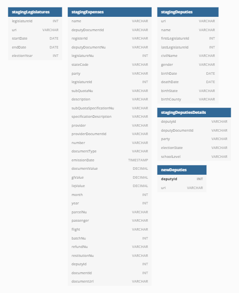
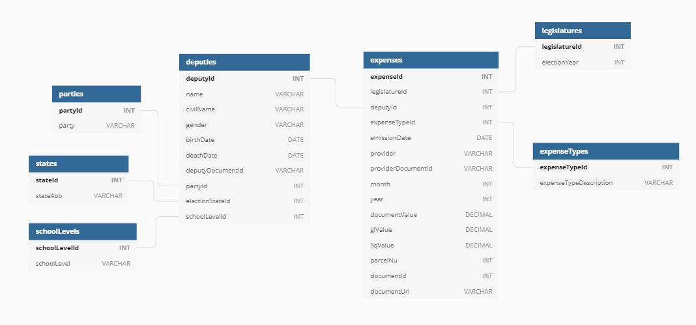
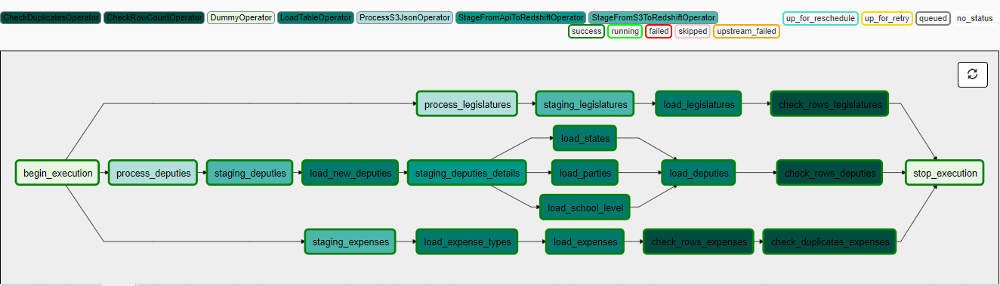
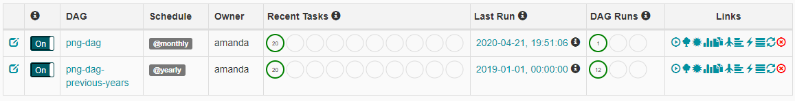

# Udacity Data Engineering Nanodegree - Capstone Project

## Description

The [deputies](https://en.wikipedia.org/wiki/Deputy_(legislator)) in Brazil have a quota (_Cota para Exercício de Atividade Parlamentar_) they can use to cover their profissional expenditures, such as mailing and plane tickets. Since 2008 the data related to this quota is available to the public and can be used to analyze the deputies expenditures of this federal resource.

The objective of this project is to create a database in which is possible to analyze the expenditures of the deputies and answer questions like:

* What is the main expenditure?
* What are the main types of expenditures?
* What is the mean value of the expenditures? Does it change depending on the election year, party, state or school level of deputy?
* Who spends more/less?

## Data Sources

To make it easier to understand/correct I uploaded to S3 a version with headers translated to English. This is the version which I'm going to use on the project. The `deputies details` data source is the only one that is in Portuguese, since it is an API request and can't be translated before the request.

### Legislature

This data is originally available in:
[http://dadosabertos.camara.leg.br/arquivos/legislaturas/json/legislaturas.json]

Example of one of the nodes of the json:

```
{
    "legislatureId": 56,
    "uri": "https://dadosabertos.camara.leg.br/api/v2/legislaturas/%s56",
    "startDate": "2019-02-01",
    "endDate": "2023-01-31",
    "electionYear": 2018
}
```

### Deputies

This data is originally available in:
[http://dadosabertos.camara.leg.br/arquivos/deputados/json/deputados.json]

Example of one of the nodes of the json:

```
{
    "uri": "https://dadosabertos.camara.leg.br/api/v2/deputados/2",
    "name": "LOPES GAMA",
    "firstLegislatureId": 1,
    "lastLegislatureId": 2,
    "civilName": "Caetano Maria Lopes Gama",
    "gender": "M",
    "socialMediaUrl": [],
    "websiteUrl": [],
    "birthDate": "1795-08-05",
    "deathDate": "1864-06-21",
    "birthState": "PE",
    "birthCounty": "Recife"
}
```

### Deputies Details

Since not all data of the deputies are available in the previous json, we obtained more details using the API and the `uri` for each deputy.

Example of the response for one deputy detail request:

```
<xml>
    <dados>
        <id>1000</id>
        <uri>
https://dadosabertos.camara.leg.br/api/v2/deputados/1000
        </uri>
        <nomeCivil>Olympio Euzebio Arroxellas Galvão</nomeCivil>
        <ultimoStatus>
            <id>1000</id>
            <uri>
https://dadosabertos.camara.leg.br/api/v2/deputados/1000
            </uri>
            <nome>OLÍMPIO GALVÃO</nome>
            <siglaPartido/>
            <uriPartido/>
            <siglaUf>AL</siglaUf>
            <idLegislatura>15</idLegislatura>
            <urlFoto>
https://www.camara.leg.br/internet/deputado/bandep/1000.jpg
            </urlFoto>
            <email/>
            <data/>
            <nomeEleitoral>OLÍMPIO GALVÃO</nomeEleitoral>
            <gabinete>
                <nome/>
                <predio/>
                <sala/>
                <andar/>
                <telefone/>
                <email/>
            </gabinete>
            <situacao>Vacância</situacao>
            <condicaoEleitoral>Titular</condicaoEleitoral>
            <descricaoStatus/>
        </ultimoStatus>
        <cpf/>
        <sexo>M</sexo>
        <urlWebsite/>
        <redeSocial/>
        <dataNascimento>1842-01-28</dataNascimento>
        <dataFalecimento/>
        <ufNascimento>AL</ufNascimento>
        <municipioNascimento>Maceió</municipioNascimento>
        <escolaridade>Superior</escolaridade>
    </dados>
    <links>
        <link>
            <rel>self</rel>
            <href>
https://dadosabertos.camara.leg.br/api/v2/deputados/1000
            </href>
        </link>
    </links>
</xml>
```

From this response we will use:
* deputy id: dados.id
* deputy document id: dados.cpf
* party: dados.ultimoStatus.siglaPartido
* election state: dados.ultimoStatus.siglaUf
* school level: dados.escolaridade

### Expenses

This data is originally available in:
[http://www.camara.leg.br/cotas/Ano-{year}.csv.zip]

Example of one line of the csv:

|name|deputyDocumentId|registerId|deputyDocumentNu|legislatureNu|stateCode|party|legislatureId|subQuotaNu|description|subQuotaSpecificationNu|specificationDescription|provider|providerDocumentId|number|documentType|emissionDate|documentValue|glValue|liqValue|month|year|parcelNu|passenger|flight|batchNu|refundNu|restitutionNu|deputyId|documentId|documentUrl|
|---|---|---|---|---|---|---|---|---|---|---|---|---|---|---|---|---|---|---|---|---|---|---|---|---|---|---|---|---|---|---|
|Norma Ayub|28008901187|66179|282|2019|ES|DEM|56|1|MANUTENÇÃO DE ESCRITÓRIO DE APOIO À ATIVIDADE PARLAMENTAR|0||EDP ESPIRITO SANTO DISTRIBUICAO DE ENERGIA S.A.|281.526.500/0017-1|041048291|0|2020-01-27T00:00:00|35.05|1.67|33.38|1|2020|0|||1676094|||3163|7014486|https://www.camara.leg.br/cota-parlamentar/documentos/publ/3163/2020/7014486.pdf|

This data is available since 2008 and it has almost 4 millions lines.

## Data Model

### Staging Tables

These tables are a representation of the data sources and will be used to load data to the dimensions and fact tables.



The `newDeputies` table is an auxiliary table, that contains only rows of the new deputies (deputies that are in the `stagingDeputies` but not in the `deputies`). This way we only need to call the API to get the details of the new deputies.

### Dimension and Fact Tables



#### Dimension Tables

##### Parties

|Field Name|Type|Description|
|---|---|---|
|partyId|INT PRIMARY KEY IDENTITY(1, 1)|Party id|
|party|VARCHAR(32)|Party abbreviation name|

##### States

|Field Name|Type|Description|
|---|---|---|
|stateId|INT PRIMARY KEY IDENTITY(1, 1)|State id|
|stateAbb|VARCHAR(2)|State abbreviation|

##### SchoolLevels

|Field Name|Type|Description|
|---|---|---|
|schoolLevelId|INT PRIMARY KEY IDENTITY(1, 1)|School level id|
|schoolLevel|VARCHAR(32)|School level|

##### Deputies

|Field Name|Type|Description|
|---|---|---|
|deputyId|INT PRIMARY KEY NOT NULL|Deputy id|
|name|VARCHAR(256) NOT NULL|Deputy name|
|civilName|VARCHAR(256) NOT NULL|Deputy civil name|
|gender|VARCHAR(1)|Gender|
|birthDate|DATE|Birth day|
|deathDate|DATE|Death day|
|deputyDocumentId|VARCHAR(16)|Deputy national document id|
|partyId|INT|Party id|
|electionStateId|INT|Id of the state in which the deputy got elected|
|schoolLevelId|INT|Id of the school level of the deputy|

##### ExpenseTypes

|Field Name|Type|Description|
|---|---|---|
|expenseTypeId|INT PRIMARY KEY IDENTITY(1, 1)|Id of the category of the expense|
|expenseTypeDescription|VARCHAR(256)|Category of expense|

#### Fact Table

##### Expenses

|Field Name|Type|Description|
|---|---|---|
|expenseId|INT PRIMARY KEY IDENTITY(1, 1)|Expense id|
|legislatureId|INT NOT NULL|Legislature id|
|deputyId|INT|Deputy id|
|expenseTypeId|INT|Expense type id|
|emissionDate|DATE|Emission date of the document|
|provider|VARCHAR(256)|Expense supplier/provider|
|providerDocumentId|VARCHAR(20)|Document id of the supplier/provider|
|month|INT|Month of the occurence of the expense|
|year|INT|Year of the occurence of the expense|
|documentValue|DECIMAL(9, 2)|Total value of the document|
|glValue|DECIMAL(9, 2)|Remark value of the document|
|liqValue|DECIMAL(9, 2)|Net value (total - remark) that will be debited from the quota|
|parcelNu|INT|Number of the parcel/installment of the expense|
|documentId|INT|Id of the document|
|documentUrl|VARCHAR(256)|Url of the document|

## ETL Data Pipeline

To run the ETL Apache Airflow was used to control the tasks as follows.



### Legislatures

1. process_legislatures [[ProcessS3JsonOperator]](airflow/plugins/operators/process_s3_json.py)

    Read `legislatures.json` from S3, pre-process it and saves the new file back into S3. 
    Since Redshift doesn't support array of objects some adjustments in the file were necessary. This pre-process also adjust the quote marks inside the string nodes so it won't break when
    data is loaded into Redshift.

2. staging_legislatures [[StageFromS3ToRedshiftOperator]](airflow/plugins/operators/stage_from_s3_to_redshift.py)

    Loads the pre-processed json file from S3 into `stagingLegislatures` table into Redshift.

3. load_legislatures [[LoadTableOperator]](airflow/plugins/operators/load_table.py)

    Load data from the `stagingLegislatures` table to the `legislatures`.

4. check_rows_legislatures [[CheckRowCountOperator]](airflow/plugins/operators/check_row_count.py)

    Checks if the number of the rows of `stagingLegislatures` and `legislatures` tables are the same.

### Deputies

1. process_deputies [[ProcessS3JsonOperator]](airflow/plugins/operators/process_s3_json.py)

    Read `deputies.json` from S3, pre-process it and saves the new file back into S3. 
    Since Redshift doesn't support array of objects some adjustments in the file were necessary. This pre-process also adjust the quote marks inside the string nodes so it won't break when
    data is loaded into Redshift.

2. staging_deputies [[StageFromS3ToRedshiftOperator]](airflow/plugins/operators/stage_from_s3_to_redshift.py)

    Loads the pre-processed json file from S3 into the `stagingDeputies` table into Redshift.

3. load_new_deputies [[LoadTableOperator]](airflow/plugins/operators/load_table.py)

    Verify if there is any new deputy in staging table that is not in the final table. Save the new deputies 
    in a temporary table `newDeputies` so we know who are the new deputies that we need to get the details.

4. staging_deputies_details [[StageFromApiToRedshiftOperator]](airflow/plugins/operators/stage_from_api_to_redshift.py)

    Request the details of the new deputies from the API and save the data in the `stagingDeputiesDetails`.

5. load_parties, load_states, load_school_level [[LoadTableOperator]](airflow/plugins/operators/load_table.py)

    Load data from the `stagingDeputiesDetails` table to the `parties`, `states` and `schoolLevels` tables.

6. load_deputies [[LoadTableOperator]](airflow/plugins/operators/load_table.py)

    Load data from the `stagingDeputies`, `stagingDeputiesDetails`, `parties`, `states` and `schoolLevels` tables to `deputies`.

7. check_rows_deputies [[CheckRowCountOperator]](airflow/plugins/operators/check_row_count.py)

    Checks if the number of the rows of `stagingDeputies` and `deputies` tables are the same.

### Expenses

1. staging_expenses [[StageFromS3ToRedshiftOperator]](airflow/plugins/operators/stage_from_s3_to_redshift.py)

    Loads the csv file of the current year from S3 into the `stagingExpenses` table into Redshift.

2. load_expense_types [[LoadTableOperator]](airflow/plugins/operators/load_table.py)

    Load data from the `stagingExpenses` table to the `expenseTypes` table.

3. load_expenses [[LoadTableOperator]](airflow/plugins/operators/load_table.py)

    Load data from the `stagingExpenses` and `expenseTypes` tables to `expenses`.

4. check_rows_expenses [[CheckRowCountOperator]](airflow/plugins/operators/check_row_count.py)

    Checks if the number of the rows of `expenses` is equal or greater than `stagingExpenses` tables. The `expenses` table can have more rows than the `stagingExpenses` since it will have expenses of previous
    years.

5. check_duplicate_expenses [[CheckDuplicatesOperator]](airflow/plugins/operators/check_duplicates.py)

    Checks if there are not duplicate expenses in the table, since it could create serious errors in the analysis.

## Backfilling

To load the data from the current and previous years two dags were created. Both have the same structure
shown in the ETL Pipeline, but they have different schedules.



* png_dag: runs once a month and load new data that are often updated.
* png_dag_previous_years: runs once a year from 2008 to 2019 to backfill the previous years expenses.

## Technologies

For this project I chose to use Redshift since it:
* Could read files from S3
* Has a copy command that could quickly load data from big files to tables
* Has support to json and csv
* Can execute queries fast in a big amount of data

I also used Apache Airflow to orchestrate the ETL process so I could keep track of the tasks and
the DAG runs.

## Scenarios

### The data was increased by 100x

In this case we would need to increase the number of nodes and configure the distribution key to
reduce the number of shuffling between the nodes. 
If we know the queries to be performed we could build denormalized tables and avoid joins during 
the query execution time and return the results faster.

### The pipelines would be run on a daily basis by 7 am every day

Having an idea of how much time the dag takes to run we can set the Airflow scheduler to finish before 7 am. We can also configure the SLA rule to send an email in case the dag or task takes longer than the expected.

### The database needed to be accessed by 100+ people

Besides increasing the performance of the cluster, we could build specific denormalized tables depending on
the queries these people are executing on the database. This way the execution of the queries are faster and
we decrease the overload on the database.

## Requirements

* Aws access and secret key with permission to S3 and Redshift
* Docker

## Installation and Running

1. Get Airflow image from Docker Hub

```
docker pull apache/airflow:master
```

2. Create container from image and log in it

```
docker run -p 8080:8080 --name air --entrypoint /bin/bash -ti apache/airflow:master
```

3. Init Airflow database

```
airflow db init
```

4. Start Airflow scheduler

```
airflow scheduler --daemon
```

5. Start Airflow webserver

```
airflow webserver --daemon
```

6. Use the command below to get the ip associated to the container (windows)

```
docker-machine ls
```

7. Copy the project files to the Airflow container to `/opt/airflow/` by either cloning the repository or using `docker cp`

8. Access Airflow webserver using ip or localhost

```
http://<ip|localhost>:8080
```

9. In Aws create a Redshift cluster
10. Allow ingress access in port 5439 to that cluster.
11. In the query editor, connect to the cluster and run the script to create the tables `db/create_tables.sql`.
12. In the Airflow dashboard create a Connection with the configurations:
	* Conn Id: `aws_credentials`
	* Conn Type: `Amazon Web Services`
	* Login: Access key from the IAM user
	* Password: Secret key from the IAM user
13. Create another Connection with the configurations:
	* Conn Id: `redshift`
	* Conn Type: `Postgres`
	* Host: The endpoint of the cluster (without port)
	* Schema: `dev`
	* Login: Same login of the cluster configuration
	* Password: Same password of the cluster configuration
	* Port: `5439`
14. Start the dags and check the execution

Obs.: Don't forget to delete the Redshift cluster when not in use to avoid costs.
